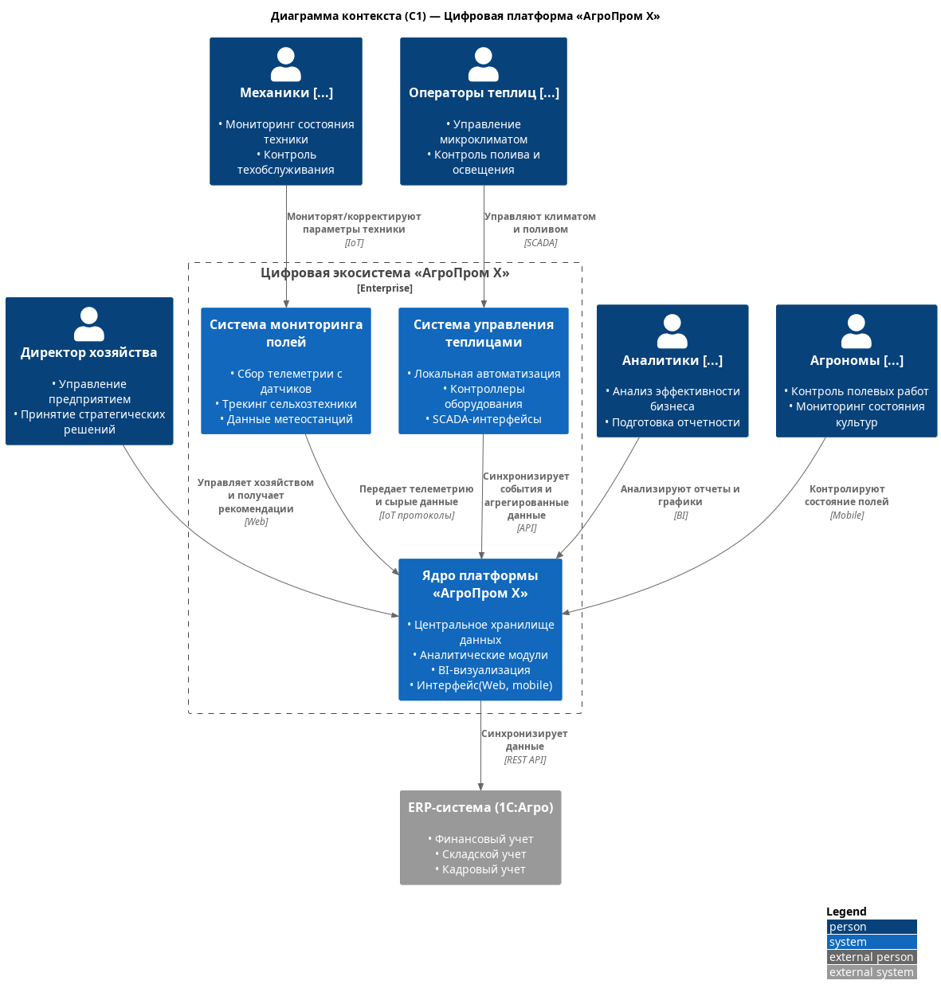
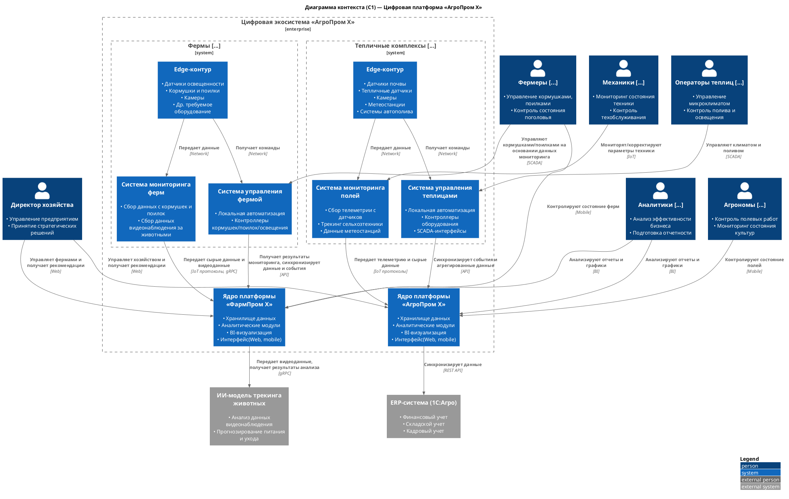
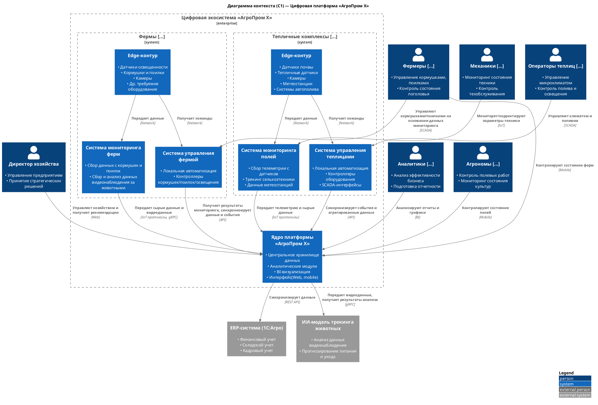

### **Название задачи:** встраивание процессов, связанные с кормлением, безопасностью и мониторингом поголовья скота, в существующий контекст 
### **Автор:**
### **Дата:**
### **Функциональные требования**
Система должна: 

|     | |
|-----| ------------- |
| Ф1  | фиксировать признаки беспокойного поведения или драк среди животных и оповещать оператора; |
| Ф2  | фиксировать признаки задавливания поросят; |
| Ф3  | управлять кормушками и поилками разных производителей; |
| Ф4  | оценивать состояние животных по внешнему виду и поведению: болезнь, гибель, беспокойство и так далее; |
| Ф5  | следить за состоянием систем фильтрации воды; |
| Ф6  | пересчитывать поголовье; |
| Ф7  | следить за запасами еды и прогнозировать расход; |
| Ф8  | поддерживать необходимое количество видеокамер для аналитики в реальном времени от разных производителей; |
| Ф9  | быть построена по принципу «центральный сервер — агенты» на конкретных фермах без ограничения количества таких агентов (в синхронизации между агентами и центральным сервером допускается задержка до 10 минут без учёта проблем со связью); |
| Ф10 | предоставлять базовые метрики для передачи в другие системы; |
| Ф11 | поддерживать возможность добавления собственных метрик; |
| Ф12 | работать даже в случае отсутствия интернета и при необходимости отправлять уведомления дежурному сотруднику на местах мониторинга, а после восстановления связи синхронизироваться с центральной системой; |
| Ф13 | иметь разделение ролей и поддерживать современные способы аутентификации и авторизации; |
| Ф14 | иметь API для создания мобильного приложения или веб-приложения. |

Верхнеуровневые Use Cases. 

| **№** | **Действующие лица или системы**                                              | **Use Case**             | **Описание**                                                                                                                                                                                                                                                                                                                                                                                                                                                                                                                                                                                                                                                                    | **Комментарий**                     |
|:-----:|:------------------------------------------------------------------------------|:-------------------------|:--------------------------------------------------------------------------------------------------------------------------------------------------------------------------------------------------------------------------------------------------------------------------------------------------------------------------------------------------------------------------------------------------------------------------------------------------------------------------------------------------------------------------------------------------------------------------------------------------------------------------------------------------------------------------------|:------------------------------------|
|  UC1  | Пользователь, Система мониторинга ферм, Платформа                             | Наблюдение за поголовьем | 1. Пользователь открывает web-интерфейс или мобильное приложение, авторизуется в системе,  2. Система определяет роль пользователя, ведущего наблюдение за поголовьем,  3. Система предоставляет пользователю соответствующие данные аналитики и оповещения о событиях                                                                                                                                                                                                                                                                                                                                                                                                  | Ф1, Ф2, Ф4, Ф6, Ф13                 |
|  UC2  | Пользователь, Система управления фермой, Платформа                            | Кормление поголовья      | 1. Пользователь входит в систему управления фермой,  2. Система запрашивает данные мониторинга у платформы,  3. Система предоставляет пользователю  данные мониторинга и интерфейс управления контроллерами устройств,  4. пользователь на основании полученных данных корректирует параметры устройств,  5. Система управления синхронизирует данные с платформой.                                                                                                                                                                                                                                                                                             | Ф7, Ф5, Ф3                          |
|  UC3  | Пользователь, Система мониторинга фермы, Система управления фермой, Платформа | Реагирование на ЧП       | 1. Система мониторинга передает данные в систему 2. Система анализирует данные мониторинга и фиксирует признаки ЧП. 3. Система инициирует событие оповещения сотрудника на месте. 4. Сотрудник получает уведомление и принимает меры, используя систему управления фермой.                                                                                                                                                                                                                                                                                                                                                                                          | Ф1, Ф5, Ф3, Ф2, Ф4, Ф7              |
|  UC4  | Устройства edge-контура, Система мониторинга ферм, Платформа                  | Мониторинг скота         | 1. Устройства edge-контура регулярно фиксируют и передают метрики/сигналы/видеоданные системе мониторинга фермы  2. Система мониторинга накапливает и анализирует сырые данные и с определенной периодичностью (ДО 10 мин) передает их в ядро платформы 3. В случае разрыва связи с платформой дальнейшее накопление данных и попытки передачи продолжаются до восстановления связи 4. Если система мониторинга в процессе анализа выявляет признаки ЧП, система инициирует отправку уведомления ответственному пользователю по доступным каналам связи. 5. Если система фиксирует недостаток корма/воды/освещенности, система инициирует отправку уведомления  ответственному пользователю по доступным каналам связи. | Ф1, Ф2, Ф4, Ф5, Ф6, Ф7, Ф8, Ф9, Ф12 |

### **Нефункциональные требования**
Система должна:

|     |                                                                                                                                                                                                                                              |
|:---:|:---------------------------------------------------------------------------------------------------------------------------------------------------------------------------------------------------------------------------------------------|
| НФ1 | обеспечивать достаточно высокую отказоустойчивость 99,95%;                                                                                                                                                                                   |
| НФ2 | быть расширяемой, то есть иметь возможность разработать новый функционал без изменений существующего;                                                                                                                                        |
| НФ3 | иметь высокую производительность — от момента возникновения нештатной ситуации, зафиксированной с помощью видеоаналитики, должно проходить не более 5 секунд до момента оповещения;                                                          |
| НФ4 | позволять системе видеоаналитики реагировать в реальном времени (миллисекунды).                                                                                                                                                              |
| Ф8  | поддерживать необходимое количество видеокамер для аналитики в реальном времени от разных производителей;                                                                                                                                    |
| Ф9  | быть построена по принципу «центральный сервер — агенты» на конкретных фермах без ограничения количества таких агентов (в синхронизации между агентами и центральным сервером допускается задержка до 10 минут без учёта проблем со связью); |
| Ф10 | предоставлять базовые метрики для передачи в другие системы;                                                                                                                                                                                 |
| Ф11 | поддерживать возможность добавления собственных метрик;                                                                                                                                                                                      |
| Ф12 | работать даже в случае отсутствия интернета и при необходимости отправлять уведомления дежурному сотруднику на местах мониторинга, а после восстановления связи синхронизироваться с центральной системой;                                   |
| Ф14 | иметь API для создания мобильного приложения или веб-приложения.                                                                                                                                                                             |

### **Решение**

Текущий контекст выглядит следующим образом

Сейчас перед компанией стоит задача — повысить эффективность в сфере животноводства и по максимуму автоматизировать процессы, связанные с кормлением, безопасностью и мониторингом поголовья скота. Решено сделать MVP и запустить отдельную платформу для мониторинга скота. На MVP планируется реализовать это на ограниченном количестве ферм, дальнейшие этапы развития предполагают расширение.

Предлагаемый целевой MVP-контекст
 

### **Альтернативы**

Альтернативный целевой контекст с переиспользованием

Вариант в целом можно было бы рассмотреть для MVP - за счет переиспользования существующего функционала в серверной части платформы он, возможно, был бы экономнее на MVP. Но в перспективе требуется отдельная система с возможностью расширения и потенциалом внешнего использования. При возрастании количества агентов и потока данных от них нагрузка на единую серверную часть может аффектить и на существующий функционал.
В части агентских систем на фермах варианты в целом схожи - возможные отличия будут рассмотрены на следующих уровнях.

**Недостатки, ограничения, риски**

| **Выбранное решение**                                                                                                                                                                                                                                                                                                                                              | **Альтернативное решение**                                                                                                                                                                                                                        |
|:-------------------------------------------------------------------------------------------------------------------------------------------------------------------------------------------------------------------------------------------------------------------------------------------------------------------------------------------------------------------|:--------------------------------------------------------------------------------------------------------------------------------------------------------------------------------------------------------------------------------------------------|
| Плюсы: 1. Более легковесная система, включающая только необходимые функции 2. Возможность использовать другие технологии, отличные от существующей платформы (более подходящие для MVP, нетребовательные к ресурсам, плюс доп. опыт и возможность сравнить) 3. Возможность выделения отдельной команды для разработки, не требуется передача экспетизы | Плюсы: 1. Возможность переиспользовать существующую инфраструктуры, технологии и даже команду разработки 2. Один интерфейс для конечных пользователей (автоматически выполняется Ф14) 3. минимизация расширения используемых ресурсов |
| Минусы: 1. Разработка с нуля требует больше времени на проектирование, выбор технологий, возможно, на дообучение команды 2. Необходимость Разработки отдельного интерфейса и мобильного приложения 3. Отдельная инфраструктура, дополнительные ресурсы                                                                                                 | Минусы: 1. Увеличение нагрузки на существующую систему - риск для текущего функционала 2. Жесткая привязка к существующим технологиям и решениям, вероятно, избыточным или не совсем подходящим для текущей задачи                    |