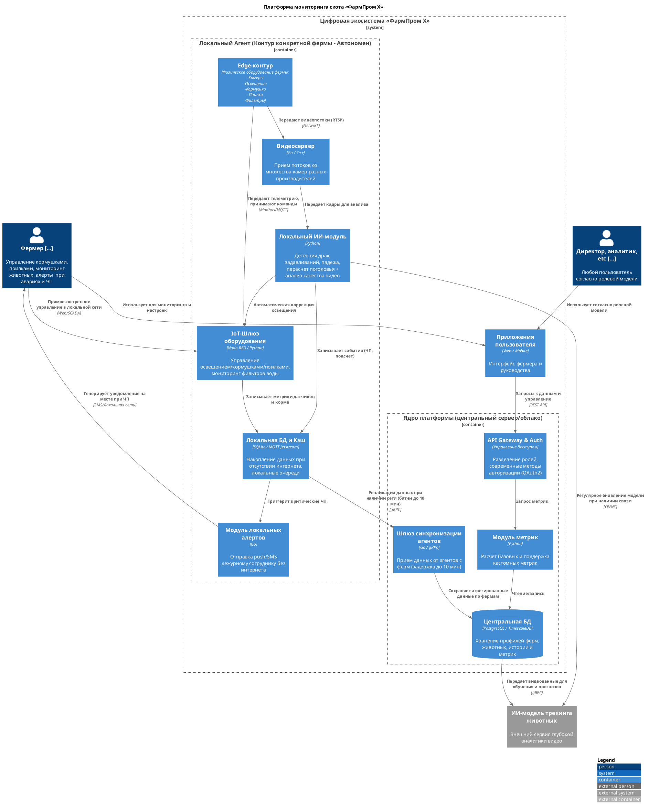
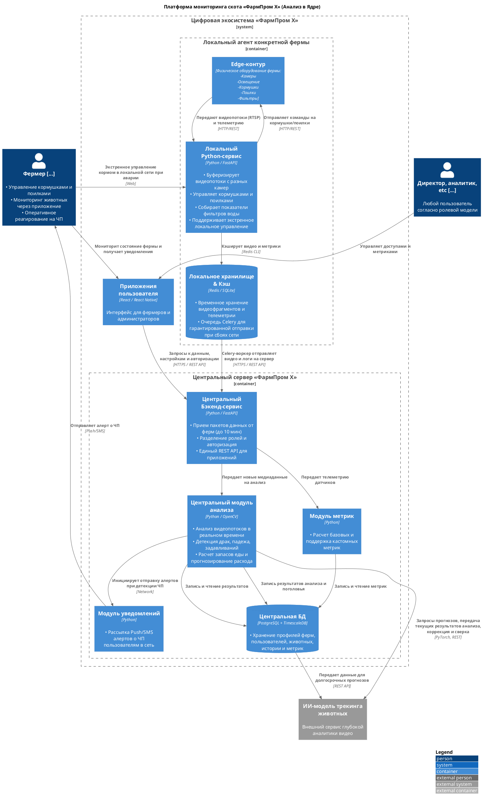

### **Название задачи:** автоматизация процессов, связанные с кормлением, безопасностью и мониторингом поголовья скота, MVP-архитектура платформы ФармПром Х
### **Автор:**
### **Дата:**
### **Функциональные требования**
Система  должна:

|     | |
|-----| ------------- |
| Ф1  | фиксировать признаки беспокойного поведения или драк среди животных и оповещать оператора; |
| Ф2  | фиксировать признаки задавливания поросят; |
| Ф3  | управлять кормушками и поилками разных производителей; |
| Ф4  | оценивать состояние животных по внешнему виду и поведению: болезнь, гибель, беспокойство и так далее; |
| Ф5  | следить за состоянием систем фильтрации воды; |
| Ф6  | пересчитывать поголовье; |
| Ф7  | следить за запасами еды и прогнозировать расход; |
| Ф8  | поддерживать необходимое количество видеокамер для аналитики в реальном времени от разных производителей; |
| Ф9  | быть построена по принципу «центральный сервер — агенты» на конкретных фермах без ограничения количества таких агентов (в синхронизации между агентами и центральным сервером допускается задержка до 10 минут без учёта проблем со связью); |
| Ф10 | предоставлять базовые метрики для передачи в другие системы; |
| Ф11 | поддерживать возможность добавления собственных метрик; |
| Ф12 | работать даже в случае отсутствия интернета и при необходимости отправлять уведомления дежурному сотруднику на местах мониторинга, а после восстановления связи синхронизироваться с центральной системой; |
| Ф13 | иметь разделение ролей и поддерживать современные способы аутентификации и авторизации; |
| Ф14 | иметь API для создания мобильного приложения или веб-приложения. |

### **Нефункциональные требования**
Система должна:

|     |                                                                                                                                                                                                                                              |
|:---:|:---------------------------------------------------------------------------------------------------------------------------------------------------------------------------------------------------------------------------------------------|
| НФ1 | обеспечивать достаточно высокую отказоустойчивость 99,95%;                                                                                                                                                                                   |
| НФ2 | быть расширяемой, то есть иметь возможность разработать новый функционал без изменений существующего;                                                                                                                                        |
| НФ3 | иметь высокую производительность — от момента возникновения нештатной ситуации, зафиксированной с помощью видеоаналитики, должно проходить не более 5 секунд до момента оповещения;                                                          |
| НФ4 | позволять системе видеоаналитики реагировать в реальном времени (миллисекунды).                                                                                                                                                              |
| Ф8  | поддерживать необходимое количество видеокамер для аналитики в реальном времени от разных производителей;                                                                                                                                    |
| Ф9  | быть построена по принципу «центральный сервер — агенты» на конкретных фермах без ограничения количества таких агентов (в синхронизации между агентами и центральным сервером допускается задержка до 10 минут без учёта проблем со связью); |
| Ф10 | предоставлять базовые метрики для передачи в другие системы;                                                                                                                                                                                 |
| Ф11 | поддерживать возможность добавления собственных метрик;                                                                                                                                                                                      |
| Ф12 | работать даже в случае отсутствия интернета и при необходимости отправлять уведомления дежурному сотруднику на местах мониторинга, а после восстановления связи синхронизироваться с центральной системой;                                   |
| Ф14 | иметь API для создания мобильного приложения или веб-приложения.                                                                                                                                                                             |

### **Решение**

Предлагаемая MVP-архитектура

### **Альтернативы**

Альтернативная архитектура (анализ в ядре, переиспользование технологий)

Вариант предполагает переиспользование большинства используемых технологий и компетенций существующей команды разработки с целью минимизации дообучения и/или расширения команды, ресурсов, времени. Для стадии MVP на ограниченном количестве ферм этот вариант приемлем, но перспективы расширения туманны.

**Недостатки, ограничения, риски**

| **Выбранное решение - Децентрализованная, локальный Edge-шлюз, AI-анализ**                                                                                                                                                                                                                                                                                                                                                                                                                                                                                                                                                                                            | **Альтернативное решение**                                                                                                                                                                                                                                                                                                                                                                                                                                                                                                                                                                                                                                                                                                                                                                                                                    |
|:----------------------------------------------------------------------------------------------------------------------------------------------------------------------------------------------------------------------------------------------------------------------------------------------------------------------------------------------------------------------------------------------------------------------------------------------------------------------------------------------------------------------------------------------------------------------------------------------------------------------------------------------------------------------|:----------------------------------------------------------------------------------------------------------------------------------------------------------------------------------------------------------------------------------------------------------------------------------------------------------------------------------------------------------------------------------------------------------------------------------------------------------------------------------------------------------------------------------------------------------------------------------------------------------------------------------------------------------------------------------------------------------------------------------------------------------------------------------------------------------------------------------------------|
| Плюсы: 1. автономность при сбоях сети: Если на ферме проблемы с интернетом, система продолжает выполнять свои главные функции на 100% (фиксирует ЧП, шлет алерты сотруднику на месте. 2. Мгновенная реакция на ЧП (Низкий Latency): Анализ видео идет локально. Детекция занимает доли секунды, алерт дежурному и его реакция без задержек. 3. Экономия на трафике и серверных/облачных мощностях: На  сервер передаются только текстовые логи, события и готовые агрегированные метрики, что будет плюсом там, где медленный мобильный / спутниковый интернет. 4. Локальные edge-шлюз и видеосервер разделены, что упрощает эксплуатацию и обслуживание. | Плюсы: 1. Скорость разработки MVP: Команда пишет код на знакомом стеке (Python/FastAPI/Redis). 2. Проще железо на фермах: Локальный агент просто накапливает данные в Redis.   3. Удобство обновлений и поддержки: Весь «интеллект» системы на сервере (в ЦОДе или облаке).  4. Централизованный сбор данных: Все видеоданные автоматически стекаются в ядро, что упрощает дообучение нейросетей и их интеграцию со сторонней моделью трекинга животных.                                                                                                                                                                                                                                                                                                                                                                      |
| Минусы: 1. Зоопарк технологий: Потребуется расширять или дообучать людей в команде под Go, Node-RED, MQTT Jetstream и ONNX runtime, которых в компании сейчас нет. 2. Сложность обновления и поддержки: Обновить ИИ-модель или исправить баг в коде агента будет сильно сложнее при расширении на десятки удаленных ферм.  3. Высокая стоимость оборудования на местах: На каждой ферме придется ставить не просто  сервер-сборщик, а производительное железо для локального инференса нейросетей.                                                                                                                                                        | Минусы: 1. Критическая задержка алертов при сбоях сети: Самый главный компромисс. Если интернет на ферме пропадет, локальный Redis закеширует видео, но анализ начнется только при восстановлении связи. 2. Высокие требования к пропускной способности сети: Передача на сервер/  облако тяжелых медиаданных, что критично там, где медленный/нестабильный интернет. 3. Высокая нагрузка на сервер: он должен обладать приличными мощностями, чтобы одновременно обрабатывать параллельные видеопотоки со всех подключенных ферм в реальном времени. При масштабировании на новые фермы расходы на облако будут расти линейно. 4. Локальный сервис перегружен функциями - является и edge-шлюзом, и видеосервером, и локальной точкой управления, что делает его узким местом и снижает отказоустойчивость систем на фермах. |