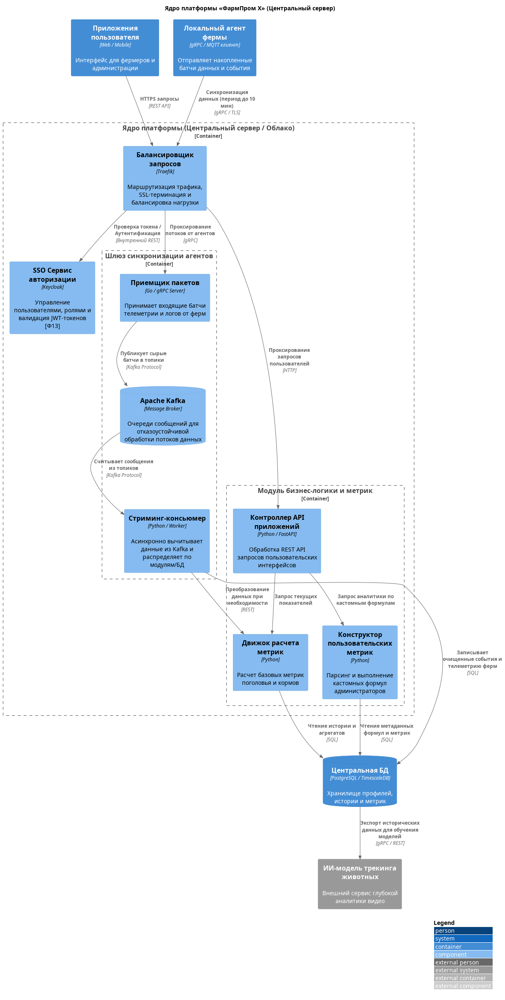
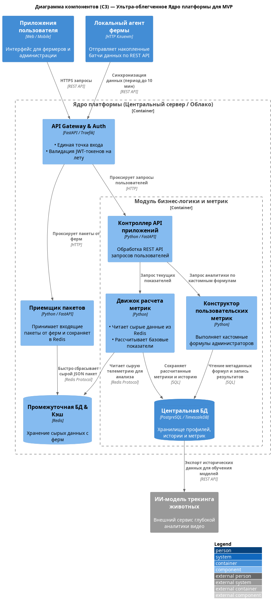

### **Название задачи:** автоматизация процессов, связанные с кормлением, безопасностью и мониторингом поголовья скота, MVP-архитектура платформы ФармПром, детализация ядра платформы.
### **Автор:**
### **Дата:**
### **Функциональные требования**
Система должна:

|     | |
|-----| ------------- |
| Ф1  | фиксировать признаки беспокойного поведения или драк среди животных и оповещать оператора; |
| Ф2  | фиксировать признаки задавливания поросят; |
| Ф3  | управлять кормушками и поилками разных производителей; |
| Ф4  | оценивать состояние животных по внешнему виду и поведению: болезнь, гибель, беспокойство и так далее; |
| Ф5  | следить за состоянием систем фильтрации воды; |
| Ф6  | пересчитывать поголовье; |
| Ф7  | следить за запасами еды и прогнозировать расход; |
| Ф8  | поддерживать необходимое количество видеокамер для аналитики в реальном времени от разных производителей; |
| Ф9  | быть построена по принципу «центральный сервер — агенты» на конкретных фермах без ограничения количества таких агентов (в синхронизации между агентами и центральным сервером допускается задержка до 10 минут без учёта проблем со связью); |
| Ф10 | предоставлять базовые метрики для передачи в другие системы; |
| Ф11 | поддерживать возможность добавления собственных метрик; |
| Ф12 | работать даже в случае отсутствия интернета и при необходимости отправлять уведомления дежурному сотруднику на местах мониторинга, а после восстановления связи синхронизироваться с центральной системой; |
| Ф13 | иметь разделение ролей и поддерживать современные способы аутентификации и авторизации; |
| Ф14 | иметь API для создания мобильного приложения или веб-приложения. |

### **Нефункциональные требования**
Система должна:

|     |                                                                                                                                                                                                                                              |
|:---:|:---------------------------------------------------------------------------------------------------------------------------------------------------------------------------------------------------------------------------------------------|
| НФ1 | обеспечивать достаточно высокую отказоустойчивость 99,95%;                                                                                                                                                                                   |
| НФ2 | быть расширяемой, то есть иметь возможность разработать новый функционал без изменений существующего;                                                                                                                                        |
| НФ3 | иметь высокую производительность — от момента возникновения нештатной ситуации, зафиксированной с помощью видеоаналитики, должно проходить не более 5 секунд до момента оповещения;                                                          |
| НФ4 | позволять системе видеоаналитики реагировать в реальном времени (миллисекунды).                                                                                                                                                              |
| Ф8  | поддерживать необходимое количество видеокамер для аналитики в реальном времени от разных производителей;                                                                                                                                    |
| Ф9  | быть построена по принципу «центральный сервер — агенты» на конкретных фермах без ограничения количества таких агентов (в синхронизации между агентами и центральным сервером допускается задержка до 10 минут без учёта проблем со связью); |
| Ф10 | предоставлять базовые метрики для передачи в другие системы;                                                                                                                                                                                 |
| Ф11 | поддерживать возможность добавления собственных метрик;                                                                                                                                                                                      |
| Ф12 | работать даже в случае отсутствия интернета и при необходимости отправлять уведомления дежурному сотруднику на местах мониторинга, а после восстановления связи синхронизироваться с центральной системой;                                   |
| Ф14 | иметь API для создания мобильного приложения или веб-приложения.                                                                                                                                                                             |

### **Решение**

Детализированная диаграмма компонентов ядра платформы - основной вариант:

### **Альтернативы**

Альтернативный вариант (для MVP):

Альтернативный вариант выглядит гораздо более легковесно для старта проекта. Для стадии MVP (когда ферм и локальных агентов еще мало) развертывание, настройка и поддержка кластера Apache Kafka вроде как избыточны — это создает лишнюю нагрузку на команду. В качестве альтернативы для шлюза синхронизации предлагался гибридный подход с промежуточной оперативной БД (Redis), которая уже есть в стеке. Redis будет использоваться одновременно как легковесный брокер (через механизм Redis Streams) и как база данных для быстрого промежуточного сохранения пакетов. Но риск потери данных, а также перспективы дальнейшего развития и масштабирования делают такой вариант узким местом. 
К тому же, Kafka тоже уже есть в стеке Агропрома, так что для команды это не выглядит проблемой.

**Недостатки, ограничения, риски**

| **Выбранное решение - перспектива масштабирования, минимальные потери с Kafka**                                                                                                                                                                                                                                                                                                                                                                                      | **Альтернативное решение**                                                                                                                                                                                                                                                                                                                                                                  |
|:---------------------------------------------------------------------------------------------------------------------------------------------------------------------------------------------------------------------------------------------------------------------------------------------------------------------------------------------------------------------------------------------------------------------------------------------------------------------|:--------------------------------------------------------------------------------------------------------------------------------------------------------------------------------------------------------------------------------------------------------------------------------------------------------------------------------------------------------------------------------------------|
| Плюсы: 1.  Максимальная надежность и отказоустойчивость. Kafka гарантирует сохранность данных. При падении БД или модулей метрик данные накопятся в топиках и обработаются позже. 2. Высокая производительность при росте системы. Бизнес-контроллер запрашивает уже предрассчитанные воркерами данные из основной БД. 3. Практически безграничный потенциал масштабирования. Архитектура готова к подключению тысяч ферм и терабайтам потоковых данных. | Плюсы: 1. Однородный стек. Вся бизнес-логика пишется на Python (FastAPI). В качестве брокера выступает уже знакомый Redis. 2. Высокая скорость реализации для MVP. Минимальное количество компонентов позволяет запустить ядро быстро. 3. Минимальное потребление ресурсов. Буфер в Redis работает в оперативной памяти и потребляет минимум ресурсов на небольших объемах MVP. |
| Минусы: 1. Потребуется администрирование Kafka и Keycloak. 2. Требуется время на развертывание, конфигурацию политик Keycloak и настройку топиков/партиций Kafka. 3. Для стабильной работы кластера Kafka, Zookeeper и Keycloak требуются значительные объемы RAM и CPU | Минусы: 1. Если оперативная память сервера с Redis переполнится или сервер перезагрузится без настроенного Persistence, данные теряются.       2. При росте объемов движок метрик берет на себя нагрузку по вычитыванию и парсингу сырого JSON из Redis на лету. 3.  При росте количества ферм до нескольких десятков Redis превратится в бутылочное горлышко, и схему придется усложнять.|